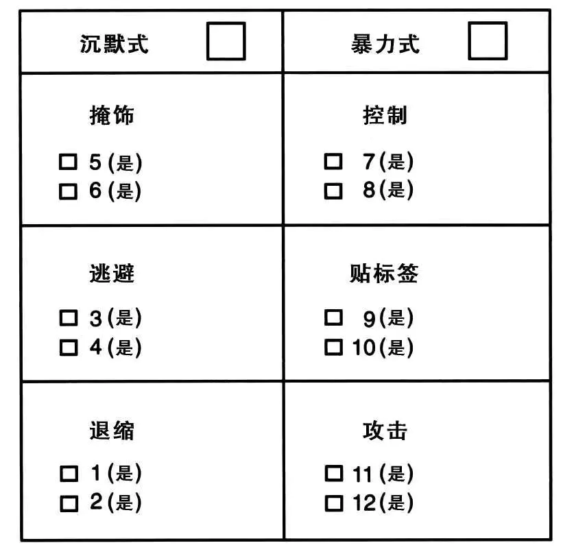
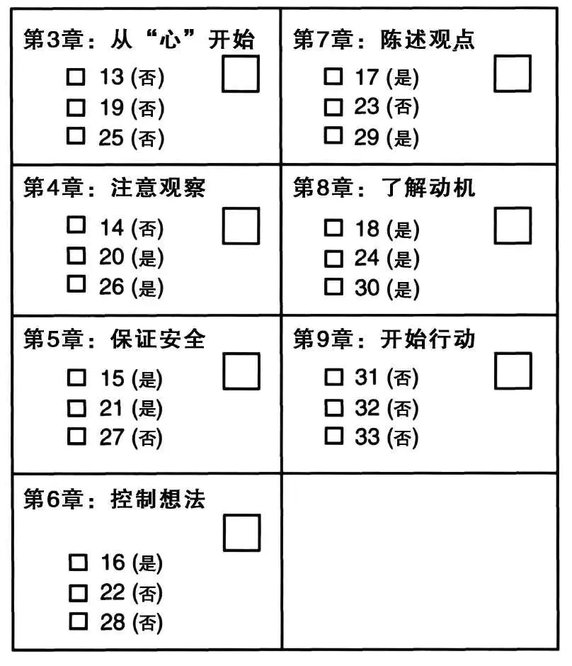

# 关键对话压力应对测试评估表

## 压力应对方式评估

> 揭示在关键对话中，你经常会采用沉默还是暴力的应对方式。

## 对话技巧评估

> 能让你了解哪些章节的内容对你最有帮助。
>
> 有 7 个模块，代表着本书 7 章核心内容对应的各种技巧。如果你的得分较高（每个部分选中 2 ～ 3 个问题），表明你对这方面的技巧很熟练。如果你的得分较低（每个部分选中 1 个或未选中问题），表明你需要特别留意这方面的技巧。

